# FORNO Restaurant OS

FORNO Restaurant OS is a full-stack restaurant operations platform for modern dine-in, takeaway, delivery, cashier, kitchen, offline POS, receipt printing, and recipe-driven inventory workflows.

The project started from the MIT-licensed FinOpenPOS codebase and has been refocused into a bilingual restaurant operating system for FORNO-style restaurants in Egypt, with branch-scoped security, Egyptian pound pricing, offline continuity, thermal printing, and inventory foundations.

<p align="center">
  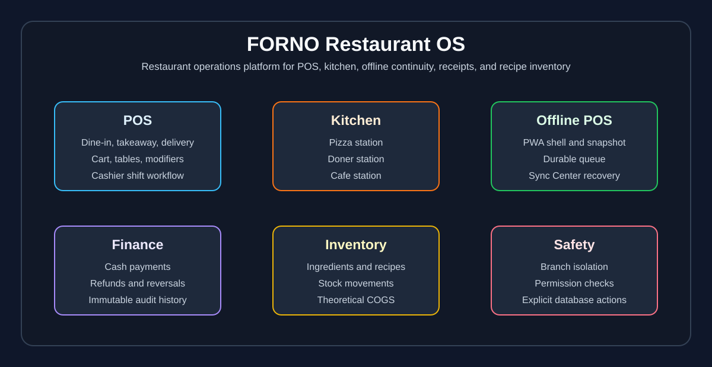
</p>

## Real Project Screenshots

These screenshots were captured from the running FORNO application with seeded data and an authenticated admin session.

| Login | Admin Dashboard |
| --- | --- |
| 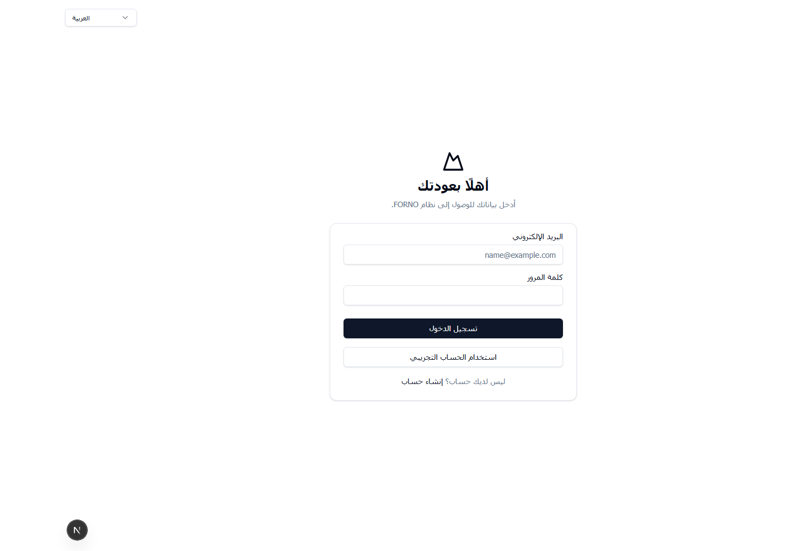 | 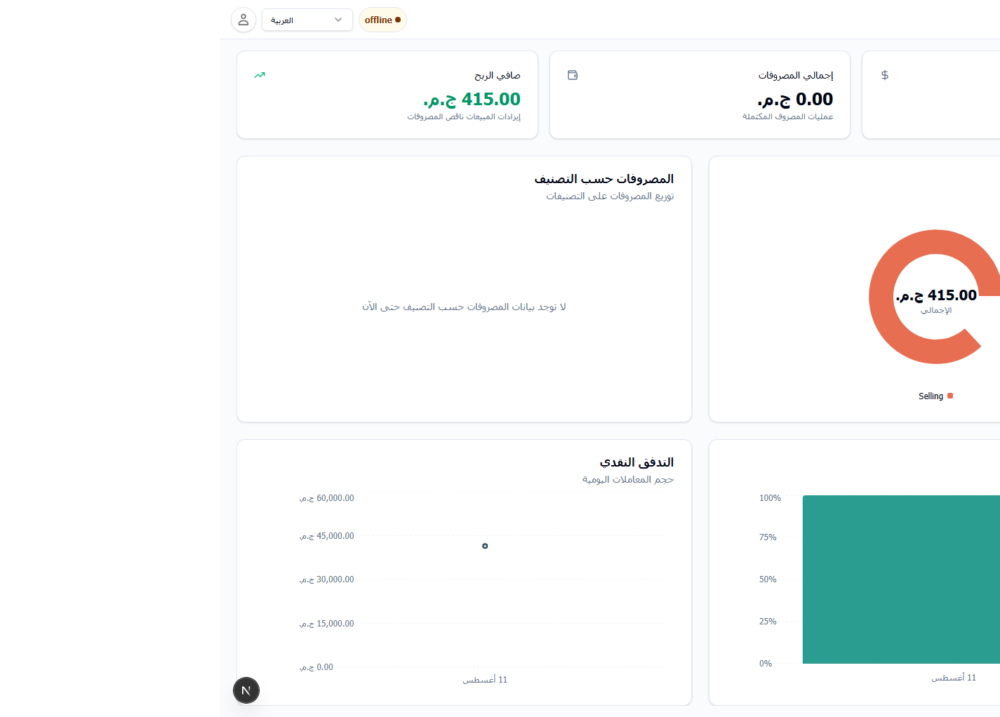 |

| POS | Sync Center |
| --- | --- |
| 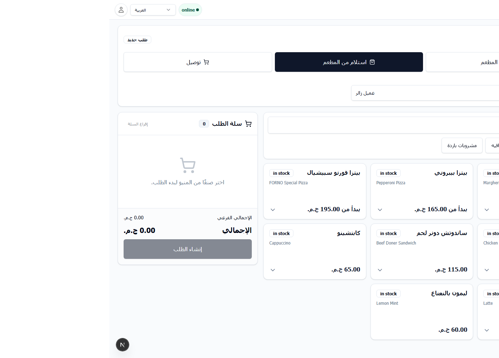 | 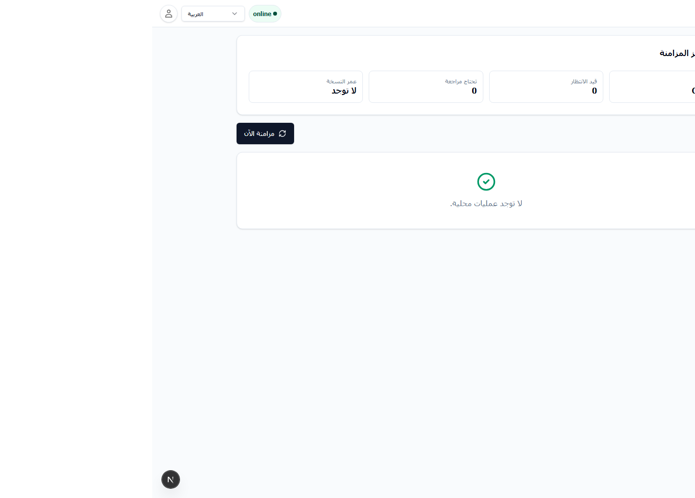 |

| Inventory Overview | Ingredients |
| --- | --- |
| 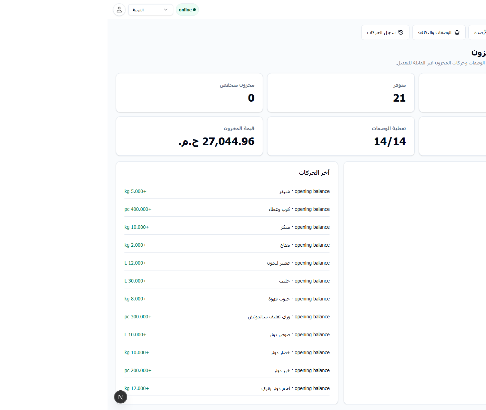 | 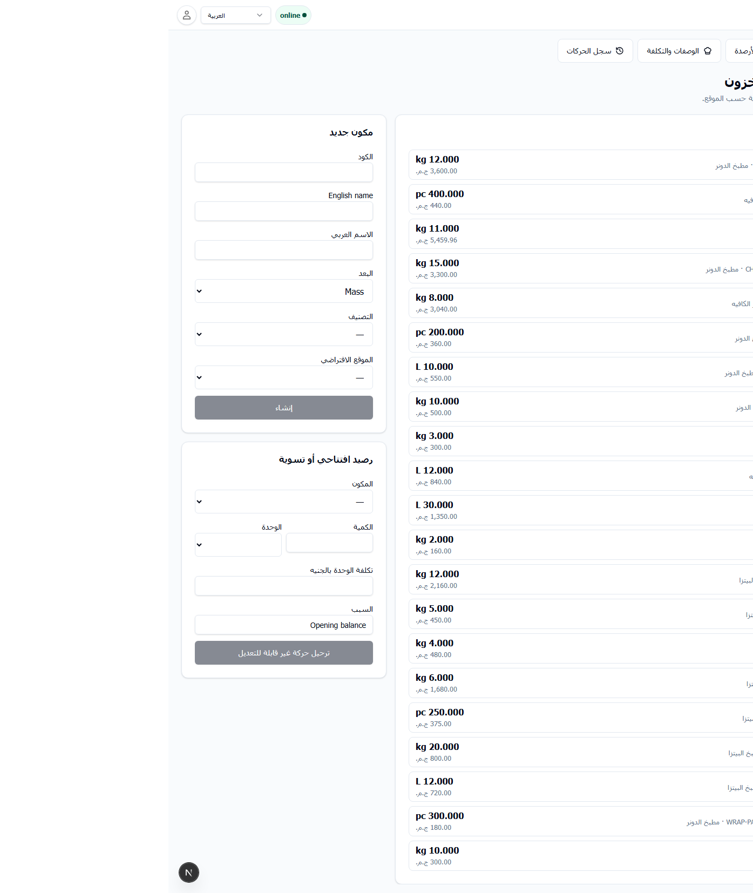 |

| Recipe Costing | Stock Movement Ledger |
| --- | --- |
| 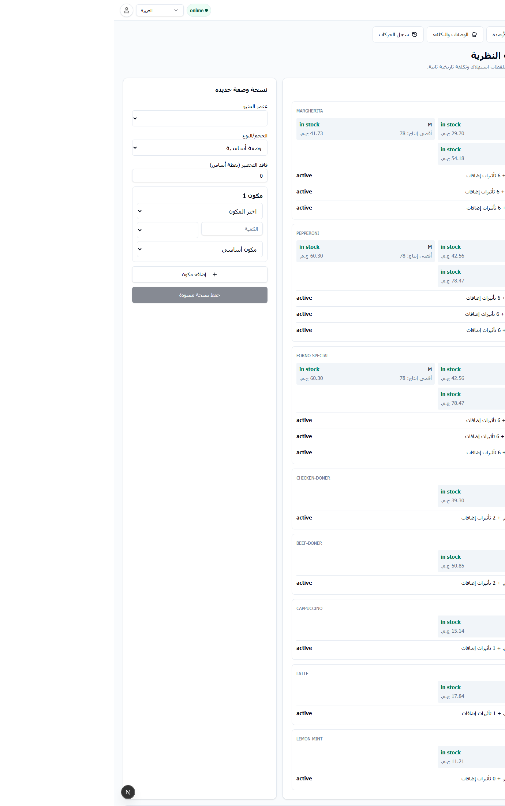 | 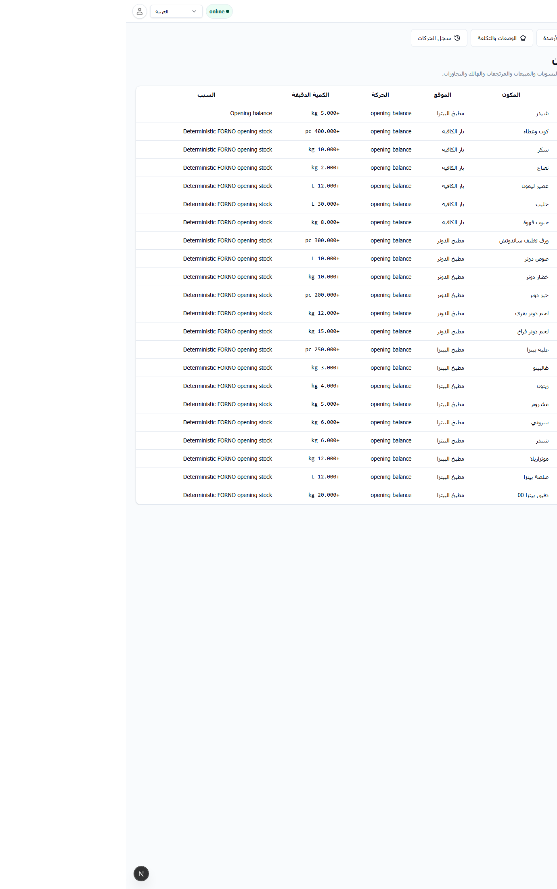 |

| Orders |
| --- | --- |
| 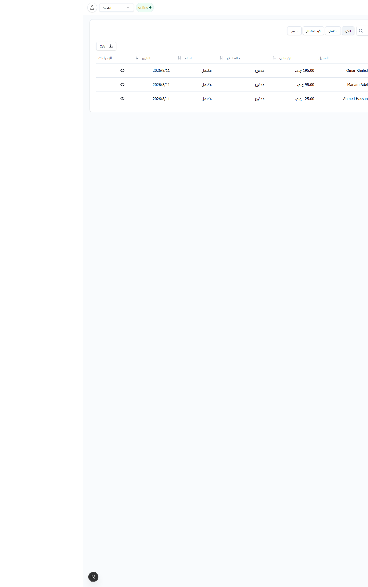 |

## What Has Been Built

FORNO now covers the operational backbone of a restaurant POS:

- Branches, registers, cashier shifts, user roles, permissions, and audit history.
- POS order entry for dine-in, takeaway, and delivery.
- Menu categories, items, variants, modifiers, notes, dining areas, and tables.
- Online checkout, cash payments, financial history, refunds, reversals, and cancellation controls.
- Thermal customer receipts and kitchen order tickets.
- Station-routed KOT printing for Pizza, Doner, and Cafe stations.
- Offline POS application shell, local bootstrap snapshot, durable queue, synchronization engine, conflict recovery, and Sync Center.
- Immediate offline cash receipts that can be printed before internet connectivity returns.
- Recipe-driven inventory foundations with exact units, stock movements, current balances, recipe versions, and theoretical COGS.
- Supplier master data and purchase orders with exact quantities, server-calculated totals, lifecycle approvals, and audit history.
- Seeded FORNO demo data for realistic restaurant operation.
- Database-safety guarantees so builds and app startup do not mutate runtime databases.

## Completed Phases

| Phase | Status | Summary |
| --- | --- | --- |
| Phase 2B1 | Complete | Financial operations, cash flow, refunds, reversals, permissions, and audit behavior. |
| Phase 2B2A | Complete | Thermal customer receipt and KOT printing. |
| Phase 2B2B | Complete | Offline POS operation, PWA support, durable sync queue, Sync Center, conflict recovery, and offline cash synchronization. |
| Offline receipt fix | Complete | Printable offline cash receipts immediately after cash is accepted offline. |
| Phase 3A | Complete | Recipe-driven inventory foundations, automatic ingredient consumption, exact quantities, weighted-average cost, and theoretical product cost. |
| Phase 3B1 | Complete | Branch-scoped suppliers and procurement-only purchase orders. Receiving and stock posting remain deferred. |

## POS And Kitchen Flow

The POS supports operational restaurant ordering while keeping kitchen and financial records separated. Payment does not drive kitchen production; order confirmation and production stages determine kitchen and inventory actions.

```text
Cashier creates order
        |
        v
Order confirmed / sent to kitchen
        |
        +--> Station KOTs: Pizza, Doner, Cafe
        |
        +--> Inventory consumption snapshot
        |
        v
Checkout and payment
        |
        v
Receipt and financial audit records
```

## Offline POS And Synchronization

Offline POS is designed for real restaurant continuity. A cashier who authenticated online can keep selling with a cached branch/register/shift/menu snapshot. Offline cash sales are never silently discarded; if the server cannot accept them later, they move to a manager-controlled Needs Review state.

<p align="center">
  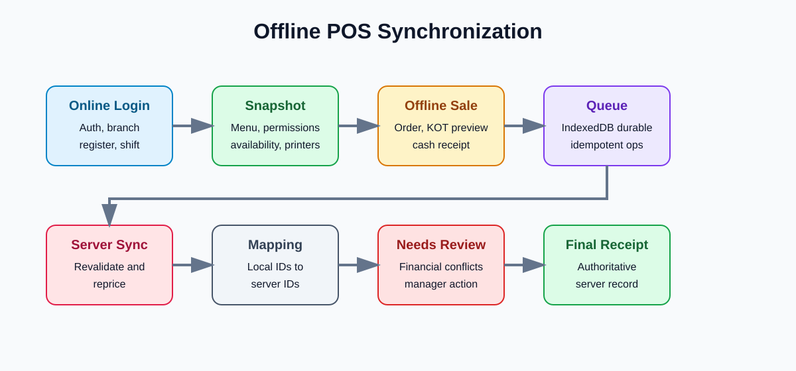
</p>

Offline support includes:

- Service worker and PWA application shell.
- Versioned IndexedDB storage for bootstrap snapshots, local orders, receipt snapshots, print acknowledgements, and queue entries.
- Online, Offline, Syncing, Synced, Failed, and Needs Review states.
- A real server health check in addition to `navigator.onLine`.
- Locally generated request IDs, idempotency keys, and deterministic offline receipt numbers.
- Single synchronization leader protection across browser tabs.
- Exponential retry with jitter and conflict classification.
- Server-authoritative validation and repricing during synchronization.
- Authoritative ID mapping after successful synchronization.

Blocked while offline:

- Card, InstaPay, and split payments.
- Opening or closing shifts.
- Cash drawer adjustments.
- Discounts.
- Refunds, reversals, paid cancellations, and unpaid cancellations.
- Receipt or KOT reprints.
- Permission and configuration changes.

## Offline Cash Receipts

A customer who pays cash while the POS is offline receives a printable customer document immediately. It is not a final server receipt, and it does not claim fiscal registration or server synchronization before the server acknowledges it.

<p align="center">
  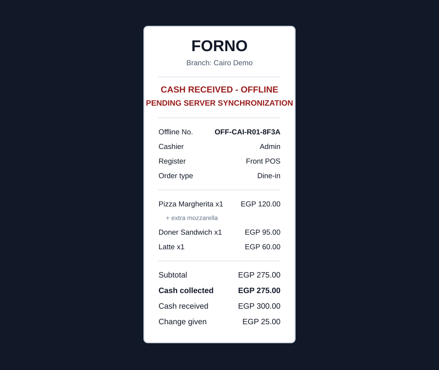
</p>

The offline cash receipt includes:

- FORNO and cached branch name.
- Human-readable offline receipt number.
- Date and local checkout time.
- Cashier, register, cached shift, order type, dining area, and table when applicable.
- Delivery/customer minimum details when applicable.
- Items, quantities, variants, modifiers, subtotal, cash collected, cash received, and change given.
- Bilingual status: `CASH RECEIVED - OFFLINE` and `PENDING SERVER SYNCHRONIZATION`.
- 80 mm thermal layout by default, optional 58 mm layout, and Arabic, English, or bilingual output.

The receipt is rendered from an immutable local snapshot created when offline cash is accepted. The snapshot survives refresh, browser restart, POS navigation, and interrupted synchronization.

## Inventory And Recipe Foundations

Phase 3A adds the foundation for recipe-driven inventory. Phase 3B1 adds supplier master data and purchase-order planning without adding receiving, transfers, full stock counts, forecasting, or full accounting.

<p align="center">
  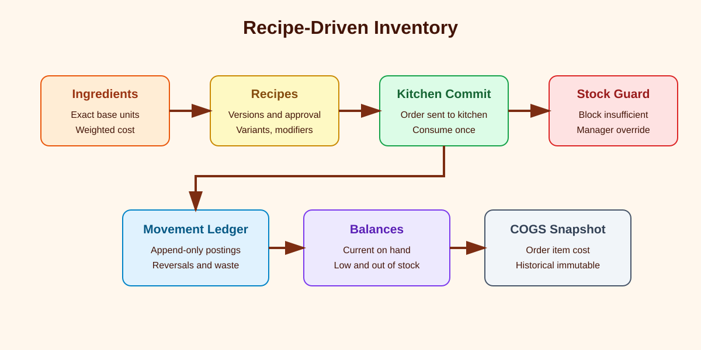
</p>

Inventory capabilities:

- Branch-scoped inventory locations such as Main Store, Pizza Kitchen, Doner Kitchen, and Cafe Bar.
- Ingredient categories, ingredients, base units, package conversions, reorder levels, low-stock thresholds, par levels, and archive rules.
- Exact fixed-point stock quantities using integer base units and rational conversion factors.
- Immutable stock movement ledger.
- Current-balance projection maintained transactionally from posted movements.
- Opening balances, manual adjustments, sale consumption, sale-consumption reversal, waste/discard, and negative-stock override movements.
- Moving weighted-average ingredient cost.
- Recipe versions with base components, variant deltas, modifier deltas, effective time, approval metadata, and historical immutability.
- Order-level inventory consumption snapshots and order-item COGS snapshots.
- Theoretical recipe cost, menu-item COGS, modifier cost, producible quantity, low-stock state, and out-of-stock blocking.

## Quantity And Cost Model

Persisted stock calculations do not use JavaScript floating-point values. Quantities use exact integer fixed-point representation and conversions use positive rational factors.

Supported unit dimensions:

| Dimension | Base coverage |
| --- | --- |
| Mass | milligram, gram, kilogram |
| Volume | millilitre, litre |
| Count | piece |
| Packages | ingredient-specific bag, bottle, can, box, tray, carton |

Costing uses integer minor currency units. Opening balances and trusted positive adjustments establish moving weighted-average cost. Historical order COGS remains immutable when ingredient prices or recipes change.

## Security And Database Safety

The server remains authoritative for permissions, pricing, inventory, financial state, receipt creation, audit records, and branch isolation.

Important safety rules:

- Builds do not open, migrate, seed, reset, delete, or modify runtime databases.
- Schema application and seed are explicit commands.
- Tests and production builds use isolated PGLite paths.
- Runtime databases are never automatically deleted or recreated.
- Offline IndexedDB content is treated as untrusted input.
- Sensitive data such as passwords, tokens, cookies, secrets, and internal audit metadata is not stored in offline cache data.
- Financial and inventory histories are append-only and corrected through explicit reversals or adjustments.
- Duplicate retries must not create duplicate orders, payments, receipts, KOT jobs, stock movements, or audit records.

Read [Database Safety](docs/04-database-safety.md) before changing database workflows.

## Technology

- Next.js 16
- React 19
- TypeScript
- Bun workspace tooling
- Better Auth
- Drizzle ORM
- PGLite for local development and isolated tests
- PostgreSQL-compatible schema direction
- IndexedDB and service worker PWA support

## Project Structure

```text
apps/web       Web application, POS UI, APIs, database runtime, tests
packages/api   Shared API contracts
packages/auth  Authentication helpers
packages/db    Database schema exports
packages/env   Environment configuration
packages/ui    Shared UI primitives
docs           Product scope, architecture, roadmap, and safety notes
```

## Local Development

Prerequisites:

- Bun 1.3.5 or newer.

Setup:

```bash
bun install
cp apps/web/.env.example apps/web/.env
bun run db:push
bun run db:seed
bun run dev:web
```

Open:

```text
http://127.0.0.1:3001
```

Default seeded account:

```text
Email: admin@forno.local
Password: Forno123!
```

Change seeded credentials and secrets before any real deployment.

## Useful Commands

```bash
bun run dev:web       # Start the web application
bun run check-types   # TypeScript validation
bun run build         # Production build
bun run db:push       # Explicit schema application
bun run db:seed       # Idempotent FORNO seed data
cd apps/web && bun test
```

## Documentation

- [Product Scope](docs/01-product-scope.md)
- [Roadmap](docs/02-roadmap.md)
- [Architecture](docs/03-architecture.md)
- [Database Safety](docs/04-database-safety.md)
- [Offline POS Architecture](docs/05-offline-pos-architecture.md)

## Verification Snapshot

The current implementation has been verified with:

- TypeScript checks.
- Web test suite.
- Production build with isolated PGLite paths.
- `git diff --check`.
- Seed idempotency against isolated test database.
- Real browser smoke tests for offline POS, receipts, synchronization, and Phase 3A inventory flows.

## Explicitly Deferred

The following work is intentionally outside the current completed scope:

- Supplier management.
- Purchase orders.
- Receiving.
- Stock transfers.
- Full stock counts.
- Forecasting.
- Full profit and loss accounting.
- Public website and delivery marketplace integrations.

## Origin And License

This project is based on [FinOpenPOS](https://github.com/JoaoHenriqueBarbosa/FinOpenPOS), licensed under MIT. The repository keeps the original license notice in [LICENSE](LICENSE).
