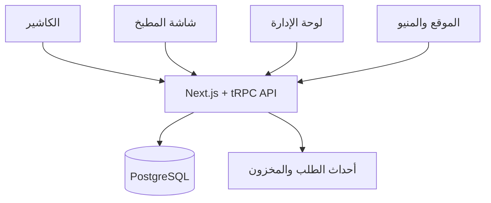

# المعمارية

## قرار البداية

سنستخدم Modular Monolith داخل Turborepo. هذا أبسط وأوثق لفرع واحد وفريق صغير، مع حدود واضحة بين Modules تسمح بفصل أي جزء لاحقًا إذا نما الحمل أو عدد الفروع.

## Modules

| Module | المسؤولية |
|---|---|
| Identity | المستخدمون، الموظفون، الأدوار، والصلاحيات |
| Catalog | المنيو، الأحجام، الإضافات، والأسعار |
| Sales | الطلب، بنوده، الدفع، الخصم، والإلغاء |
| Kitchen | المحطات، KOT، وحالات التحضير |
| Inventory | المكونات، الوصفات، الحركات، والجرد |
| Purchasing | الموردون، أوامر الشراء، والاستلام |
| Finance | الخزنة، المصروفات، وتثبيت تكلفة البيع |
| Reporting | مؤشرات المبيعات والربح والمخزون |
| Storefront | قصة المطعم والمنيو العامة |
| Printing | بناء الإيصالات وKOT من بيانات الخادم، وجدولة المعاينة وإعادة الطباعة والتدقيق |

## مبادئ البيانات

- PostgreSQL هو مصدر الحقيقة المركزي.
- كل عملية بيع تحمل `clientRequestId` فريدًا لمنع تكرارها عند المزامنة.
- المخزون Ledger: كل تغيير حركة موثقة، والرصيد ناتج عن الحركات.
- إكمال الطلب يولد حدثًا يثبت تكلفة الوصفة ويسجل حركات الاستهلاك في Transaction واحدة.
- الـPOS سيحتفظ ببيانات المنيو والطلبات غير المرسلة محليًا ليعمل عند انقطاع الإنترنت.
- مستندات الطباعة لا تستقبل أسعارًا أو محتوى ماليًا من العميل؛ يعيد الخادم بناءها من snapshots الطلب والدفع، ويحتوي KOT على أصناف محطته فقط.
- `print_jobs` يسجل الطلب والمعاينة والإقرار اليدوي كحالات مختلفة. لا يعتبر `window.print()` دليلًا على خروج ورق، ويمكن لاحقًا استبدال adapter المتصفح بجسر محلي موثوق دون تغيير منطق المستند.

## Offline POS — Phase 2B2B

- A versioned IndexedDB boundary stores a user/branch-scoped bootstrap snapshot, durable dependency-ordered operations, authoritative ID mappings, and provisional print documents. Cache Storage contains only the application shell and public static assets; API and authentication responses are always network-only.
- The browser elects one synchronization leader with Web Locks (or a short compatibility lease), retains every unacknowledged operation, and retries temporary failures with bounded exponential backoff and jitter.
- The server is authoritative for scope, permissions, shift/register/table validity, menu availability, pricing, payment, change, print jobs, and audits. Financial synchronization is transactional and idempotent.
- Rejected cash sales remain immutable Needs Review records. Manager or Owner/Admin recovery requires an audit reason and full revalidation; pending financial data cannot be cleared by logout or branch/user switching.

## Recipe-driven inventory — Phase 3A

- Quantities persist as signed fixed-point integers with `QUANTITY_SCALE = 1,000`: one base-unit quantity is stored as 1,000 micro-base units. Mass uses milligrams, volume uses millilitres, and count uses pieces as ingredient base units. Unit and package conversions are positive exact rationals (`numerator/denominator`); shared code performs reduction before multiplication, overflow checks, dimension validation, and half-away-from-zero rounding.
- Money remains integer minor units. Ingredient moving-average unit cost is stored as micro-minor-units per base unit. Receipt/order money is never recalculated with JavaScript floating point; theoretical component and order COGS use the same deterministic integer helpers on preview and server paths.
- `stock_movements` is the append-only authority. `stock_balances` is a transactionally maintained projection locked before issue/adjustment. Opening balances and positive adjustments update moving weighted-average cost. Corrections append explicit adjustment or reversal rows; no API edits or deletes posted movements.
- Recipes are immutable versions scoped by menu item and optional variant. Base components and selected modifier deltas resolve to a positive final ingredient quantity. Activation retires the previous effective configuration and preserves author/approver metadata. Unsupported references, duplicate ambiguity, incompatible units, and non-positive results are rejected.
- The production trigger is the first `pending → confirmed` transition for every fulfilment type. One database transaction locks balances, validates availability, writes an `order_inventory_issues` idempotency record, consumption and item-COGS snapshots, stock movements, current balances, audit history, and order COGS. Payment is deliberately not the trigger. Refunds do not restore prepared ingredients.
- Cancellation before issue has no inventory effect. Cancellation after issue requires `returned_unused` (exact stock reversal) or `prepared_discarded` (zero-on-hand-effect waste classification), plus an authorized user and reason.
- POS availability exposes only status and producible quantity to cashiers. Cost, recipe composition, valuation, adjustment, and override procedures remain server-permission guarded. Offline bootstrap includes a branch-scoped availability revision; synchronization revalidates stock and retains insufficient-stock cash sales as Needs Review. Manager recovery can create an audited negative balance only for ingredients configured to allow it.

## نموذج المطعم — المرحلة 1

- الفرع يملك مناطق الجلوس، الطاولات، تصنيفات المنيو، مجموعات الإضافات، ومحطات المطبخ.
- يرتبط كل Menu item بتصنيف ومحطة، ويمكن أن يملك variants وmodifier groups، مع ربط مؤقت بجدول `products` لحماية واجهة الكاشير الحالية.
- دورة الطلب: `pending → confirmed → preparing → ready`، ثم `served` للصالة أو `collected` للتيك أواي أو `delivered` للتوصيل، وأخيرًا `completed`. يُسجل كل تغيير في `order_status_history`.

## قرار التطبيقات

نبدأ بالـPOS والداشبورد كويب responsive داخل نفس التطبيق لتسريع النسخة الأولى واختبار دورة العمل. بعد ثباتها يمكن تغليف الكاشير كتطبيق Desktop عبر Tauri أو بناء Flutter client على نفس الـAPI إذا أثبتت الأجهزة الحاجة لذلك.
