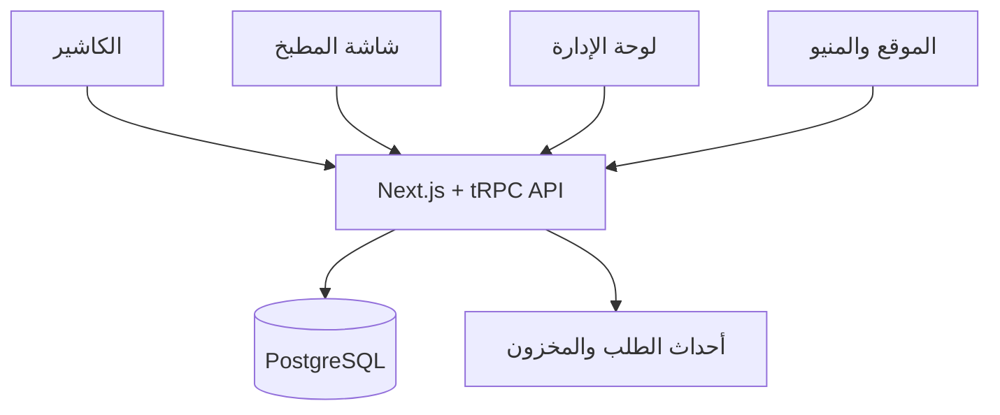

# المعمارية

## قرار البداية

سنستخدم Modular Monolith داخل Turborepo. هذا أبسط وأوثق لفرع واحد وفريق صغير، مع حدود واضحة بين Modules تسمح بفصل أي جزء لاحقًا إذا نما الحمل أو عدد الفروع.

## Modules

| Module | المسؤولية |
|---|---|
| Identity | المستخدمون، الموظفون، الأدوار، والصلاحيات |
| Catalog | المنيو، الأحجام، الإضافات، والأسعار |
| Sales | الطلب، بنوده، الدفع، الخصم، والإلغاء |
| Kitchen | المحطات، KOT، وحالات التحضير |
| Inventory | المكونات، الوصفات، الحركات، والجرد |
| Purchasing | الموردون، أوامر الشراء، والاستلام |
| Finance | الخزنة، المصروفات، وتثبيت تكلفة البيع |
| Reporting | مؤشرات المبيعات والربح والمخزون |
| Storefront | قصة المطعم والمنيو العامة |

## مبادئ البيانات

- PostgreSQL هو مصدر الحقيقة المركزي.
- كل عملية بيع تحمل `clientRequestId` فريدًا لمنع تكرارها عند المزامنة.
- المخزون Ledger: كل تغيير حركة موثقة، والرصيد ناتج عن الحركات.
- إكمال الطلب يولد حدثًا يثبت تكلفة الوصفة ويسجل حركات الاستهلاك في Transaction واحدة.
- الـPOS سيحتفظ ببيانات المنيو والطلبات غير المرسلة محليًا ليعمل عند انقطاع الإنترنت.

## نموذج المطعم — المرحلة 1

- الفرع يملك مناطق الجلوس، الطاولات، تصنيفات المنيو، مجموعات الإضافات، ومحطات المطبخ.
- يرتبط كل Menu item بتصنيف ومحطة، ويمكن أن يملك variants وmodifier groups، مع ربط مؤقت بجدول `products` لحماية واجهة الكاشير الحالية.
- دورة الطلب: `pending → confirmed → preparing → ready`، ثم `served` للصالة أو `collected` للتيك أواي أو `delivered` للتوصيل، وأخيرًا `completed`. يُسجل كل تغيير في `order_status_history`.

## قرار التطبيقات

نبدأ بالـPOS والداشبورد كويب responsive داخل نفس التطبيق لتسريع النسخة الأولى واختبار دورة العمل. بعد ثباتها يمكن تغليف الكاشير كتطبيق Desktop عبر Tauri أو بناء Flutter client على نفس الـAPI إذا أثبتت الأجهزة الحاجة لذلك.
